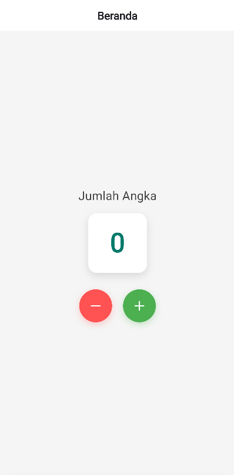
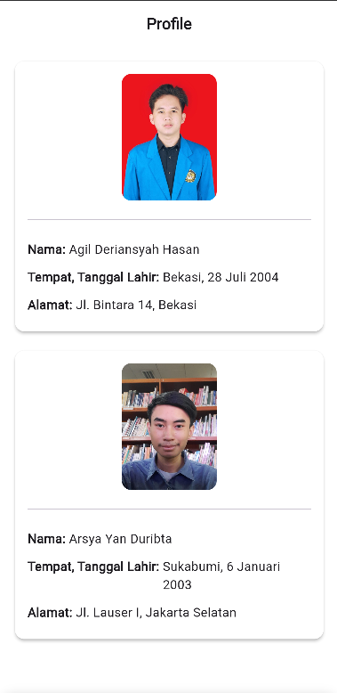

# 🌟 Aplikasi Flutter 3 Halaman - Kelompok 5 🌟

## 👥 Anggota Kelompok
| Nama                  | NPM        |
|-----------------------|------------|
| Agil Deriansyah Hasan | 4522210125 |
| Arsya Yan Duribta     | 4522210117 |

---

## 🌐 Deskripsi Aplikasi

Aplikasi ini berisi 3 halaman, yaitu:
1. Counter sederhana.
2. Menampilkan data dari API.
3. Profil anggota kelompok.

## 📸 Hasil Screenshot

### Halaman Counter

### Halaman Counter

### Halaman Profile

## Penjelasan Tiap Halaman:
- **Halaman Counter:** ...
  
- **Halaman API:** `HalamanUniversitas` adalah halaman Flutter berbasis `StatefulWidget` yang berfungsi untuk mengambil dan menampilkan daftar universitas di Indonesia menggunakan API dari **Hipolabs Universities API**. Saat halaman pertama kali dibuka, method `initState()` akan memanggil fungsi `fetchUniversitas()`, yang melakukan HTTP GET request ke endpoint `http://universities.hipolabs.com/search?country=Indonesia`. Selama data sedang diambil, halaman menampilkan widget `CircularProgressIndicator` di tengah layar sebagai indikator loading. Jika respons berhasil dengan status code 200, data JSON yang diterima di-decode menjadi list, lalu diurutkan secara alfabetis berdasarkan nama universitas menggunakan `sort()`. Setelah proses pengurutan selesai, `setState()` dipanggil untuk menyimpan data ke variabel universitas dan mengubah status loading menjadi false, sehingga tampilan halaman otomatis diperbarui.
Saat status loading sudah false, daftar universitas ditampilkan menggunakan `ListView.builder`. Setiap item universitas dirender dalam sebuah `Container` berwarna putih, menampilkan nama universitas dengan teks tebal, serta alamat website (jika tersedia) dalam teks berwarna biru, diambil dari elemen pertama `web_pages`. Jika terjadi kegagalan pengambilan data, halaman hanya menghilangkan indikator loading tanpa menampilkan data apapun. Pengelolaan state dilakukan sepenuhnya melalui `setState()` secara sederhana agar tampilan pengguna selalu sinkron dengan kondisi data terbaru, baik saat loading, berhasil memuat data, maupun saat terjadi error.
  
- **Halaman Profil:** ...

## Cara Menjalankan Aplikasi:

flutter pub get flutter run
