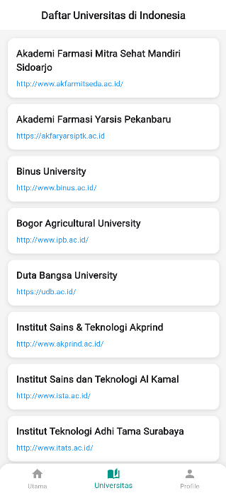

# 🌟 Aplikasi Flutter 3 Halaman - Kelompok 5 🌟

## 👥 Anggota Kelompok
| Nama                  | NPM        |
|-----------------------|------------|
| Agil Deriansyah Hasan | 4522210125 |
| Arsya Yan Duribta     | 4522210117 |

---

## 🌐 Deskripsi Aplikasi

Aplikasi ini berisi 3 halaman, yaitu:
1. Counter sederhana.
2. Menampilkan data dari API.
3. Profil anggota kelompok.

## 📸 Hasil Screenshot

### Halaman Counter

### Halaman Counter

### Halaman Profile

## Penjelasan Tiap Halaman:
- **Halaman Counter:** ...
  
- **Halaman API:** `HalamanUniversitas` adalah halaman Flutter yang menampilkan daftar universitas di Indonesia dengan mengambil data dari API universities.hipolabs.com. Saat halaman pertama kali dimuat, metode `initState` akan langsung memanggil fungsi `fetchUniversitas`, yang bertugas melakukan HTTP GET request ke endpoint API. Selama proses pengambilan data berlangsung, halaman akan menampilkan `CircularProgressIndicator` di tengah layar untuk menunjukkan bahwa data sedang dimuat. Setelah response berhasil diterima dengan status 200, data JSON yang diterima akan di-decode menjadi list, kemudian diurutkan berdasarkan nama universitas secara alfabetis. Setelah proses sorting selesai, `setState` dipanggil untuk memperbarui tampilan dengan data universitas yang sudah diproses. Data kemudian ditampilkan menggunakan ListView.builder, di mana setiap universitas dirender dalam sebuah `Container` berwarna putih. Di dalam masing-masing Container, nama universitas ditampilkan dengan teks tebal, dan alamat website universitas (jika tersedia) ditampilkan dalam teks berwarna biru.
  
- **Halaman Profil:** ...

## Cara Menjalankan Aplikasi:

flutter pub get flutter run
